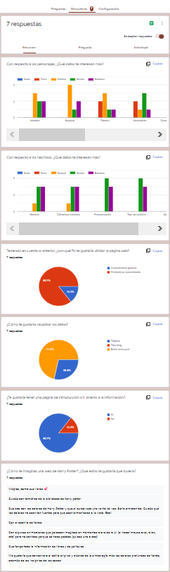

#DATA LOVERS

##INTRODUCCIÓN

Tema: Harry Potter

Resultados de encuesta pública:
* Fin: 85.7% Profundizar conocimiento
* Visualizar: 71.4% Estilo red social
* Pag Introductoria: 84.7% Sí

[Encuesta](https://forms.gle/9mKVYh39ry7kxtK29)

Usuario: 
* Fans veteranos.
* Fans de películas.

##HISTORIAS DE USUARIO
* yo como fan veterano de HP
quiero datos poco comunes
para profundizar mas en el mundo de HP

* yo como fan que vio las películas de HP
quiero datos que salen en los libros
para tener un conocimiento general del mundo de HP

##DIAGRAMA DE FLUJO

##DESARROLLO

* Comenzamos seleccionando imágenes y paletas de colores.
* A través de la encuesta que realizamos logramos decidir la idea de la interfaz y la información principal que queremos mostrar.
* Continuamos haciendo un diagrama de flujo para saber los filtros, botones y pantallas dieferentes que necesitamos.
* Aplicamos los fondos de las dos primeras html y agregamos título y botón de inicio al index.

