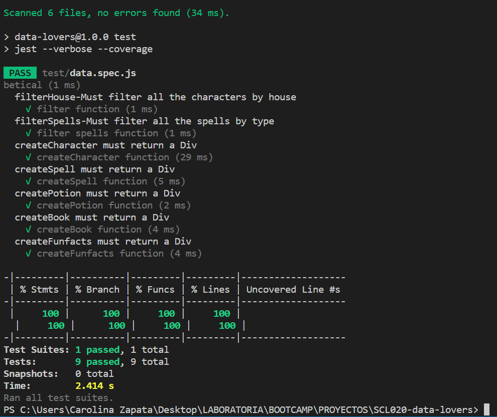

# DATA LOVERS

## INTRODUCCIÓN

Tema: Harry Potter

Resultados de encuesta pública:
* Fin: 85.7% Profundizar conocimiento
* Visualizar: 71.4% Estilo red social
* Pag Introductoria: 84.7% Sí

[Encuesta](https://forms.gle/9mKVYh39ry7kxtK29)

Usuario: 
* Fans veteranos.
* Fans de películas.

## HISTORIAS DE USUARIO
* yo como fan veterano de HP
quiero datos poco comunes
para profundizar mas en el mundo de HP

* yo como fan que vio las películas de HP
quiero datos que salen en los libros
para tener un conocimiento general del mundo de HP

## DESCRIPCIÓN DE PRODUCTO
* Crearemos una web de Harry potter que sea amigable y que de a loa usuarios una experiencia inmersiva desde el primer momento en que ingresa. Aquí podrá encontrar toda la información que necesite de la saga.

## DIAGRAMA DE FLUJO

## PROTOTIPO

* Prototipo de baja:

* [Prototipo de alta](https://www.figma.com/proto/yzVN7yna51fxq0GWQymypV/DATA-LOVERS?node-id=7%3A3&scaling=min-zoom&page-id=0%3A1&starting-point-node-id=7%3A3) (click para ver animado):

## DESARROLLO

* Comenzamos seleccionando imágenes y paletas de colores.
* A través de la encuesta que realizamos logramos decidir la idea de la interfaz y la información principal que queremos mostrar.
* Continuamos haciendo un diagrama de flujo para saber los filtros, botones y pantallas dieferentes que necesitamos.
* Aplicamos los fondos de las dos primeras html y agregamos título y botón de inicio al index.
* Logramos agregar la data sin filtrado de characters al menu.html.
* Añadimos un characters.html para trabajar con esa data.
* A characters.html modificamos elementos de css.
* A menu.html añadimos botones de las diferentes categorías y linkeamos uno a characters en js.
* Agregamos filtro de characters por house y logramos hacer que se viera en pantalla.
* Modificamos algunos aspectos de diseño para mantenerlo más limpio y ordenado.
* Añadimos spells.html y logramos mostrar la data y filtrado por tipo de spell.
* Logramos hacer que los textos queden responsive y experimentamos con los demás objetos de css.
* Actualizamos tareas en trello para ir descartando lo que ya hemos hecho.
* Terminamos con la data y su filtrado en los 5 html, characters.html, spells.html, potions.html, books.html y menu.html.
* Se agregó una barra de navegación para facilitar al usuario el moverse por las distintas pantallas.
* También redactamos una bienvenida para agregarla al menú.
* Añadimos orden alfabético para la data.
* Comenzamos a trabajar con los test.
* Tuvimos que anadir el test.enviroment: jsdom de jest para poder testear nuestras funciones createElement.
* Hubo un problema con test.enviroment ya que había que actualizar la versión de 'engines' en jest.
* Pudimos hacer todos nuestros test y nos da porcentaje superior a 70.
* Realizamos el deploy pero nuestro proyecto pierde propiedades, debemos ajustar para después poder hacer project feedback.
* Con la ayuda de Mauro logramos hacer que el deploy funcionara y no se perdieran la data ni estilo.
* Cambiamos todas las variables y funciones al inglés.
* Queríamos hacer que no aparecieran los 'null' en la data así que con el uso de ternarios y la ayuda de Dani y Domi, pudimos dejarlo como 'mistery', lo que es más acorde y no rompe toda la estética.
* Al añadir lo anterior, nuestros test bajaron a 53,84% en covertura de branch.
* Con la ayuda de Mauro logramos añadir más pruebas para que las nuevas branch estuvieran cubiertas para todos los casos y llegamos al 100% en test.
* Nos queda estudiar para el project feedback.

## TEST

